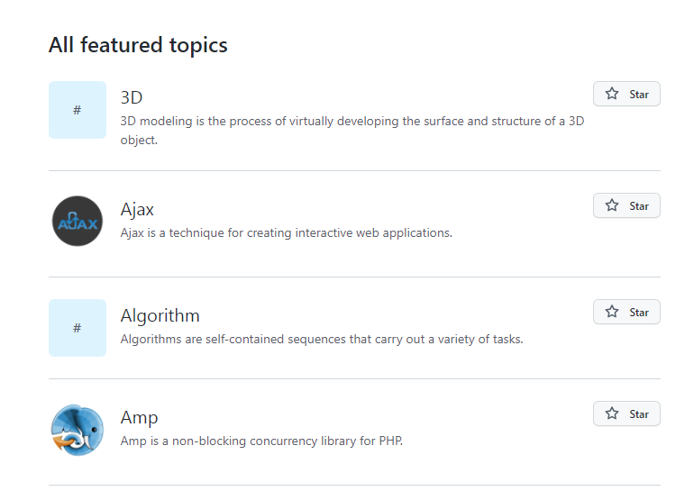
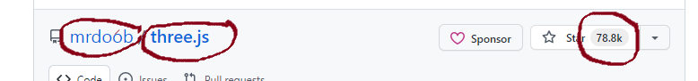

# Scraped the Github topic page
- Ths is a beginner project on web scraping.
- Followed the Tech with tim and jovian web scraping tutorial.
# Goal of this project:-
- To get popular topic in github.
- Then from each topic get information on top 30 repositories.
- Screenshot of what will be scraped:-
- These are the few examples of popular topics --->
 
and this is inside of a topic that is repo info which will be scraped
 
 
# Output from the project
- Get .csv file for each topic in the target folder.
# To see the result
- One single method is created for simplicity that is "scrap_github()".
